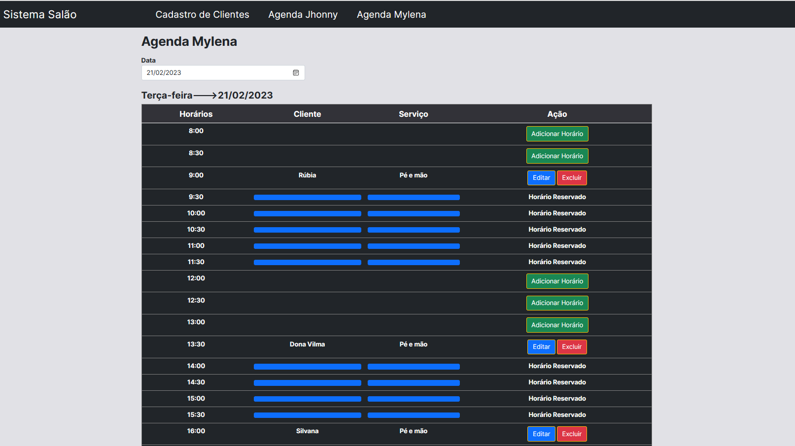
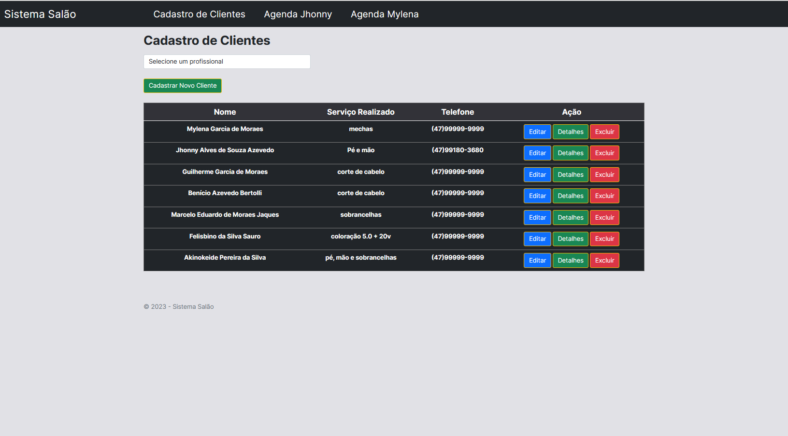

<h1 align="center"> Sistema Salão Web App </h1>

Sistema de agendamentos e cadastro de clientes desenvolvido em Asp.Net Mvc.

  <a href="#-tecnologias">Tecnologias</a>&nbsp;&nbsp;&nbsp;|&nbsp;&nbsp;&nbsp;
  <a href="#-projeto">Projeto</a>&nbsp;&nbsp;&nbsp;|&nbsp;&nbsp;&nbsp;
  <a href="#memo-licença">Licença</a>

  

 

   
   
   
  

## 🚀 Tecnologias

Esse projeto foi desenvolvido com as seguintes tecnologias:

- HTML e CSS(Bootstrap)
- jQuery
- Asp.Net Mvc C#
- Microsoft EntityFramework(Database)
- Visual Studio 2022
- .Net 6 Framework

## 💻 Projeto

O Sistema Salão é uma aplicação web que conta com um login simples, cadastro e agendamento de clientes.

##  Licença

Esse projeto está sob a licença MIT.

---

Feito com ♥ by Jhonny Azevedo --> jhonny.azevedo@gmail.com
